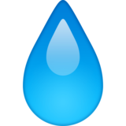

<br />
<p align="center">

  <h3 align="center">Hydrator</h3>
  <p align="center">
    A simple discord bot to remind your server members to stay hydrated
    <br />
    <a href="https://github.com/AngelNull/hydrator/archive/refs/heads/main.zip"><strong>Download</strong></a>
  </p>
</p>

# 

## Purpose
This bot was made to easily remind server members to stay hydrated at regular intervals using a role to ping them with a specified message.

## Setting Up

Hydrator requires [NodeJS](https://nodejs.org/) 14.x or higher in order to function properly.

### Making a bot application

In order to set up hydrator, first of all you must register for a discord bot application over on the [discord developer portal](https://discord.com/developers/applications), there are plenty of guides for this online, so I shall spare the details on it

### Downloading

Clone the repository or [download the code](https://github.com/AngelNull/hydrator/archive/refs/heads/main.zip) from GitHub directly.

### Install Dependancies
```bash
npm install
```
To install only production dependancies, run npm install with the ``--production`` flag.

### Configuration

Once dependancies have been installed, do `npm run config` and follow the steps to configure the base part of hydrator. 

Once you have done this, go to `src/core/config/sample` and copy commands.json and message.json into `src/core/config` and change them to your liking. 

*Note: Thumbnail and Image links must be direct links to the images and be resolvable by discord, an error will be thrown if they are not.*

## Contributing
All contributions are welcomed and encouraged, please ensure you lint your code using the included configurations otherwise it will fail the linting workflow when making a pull-request.
